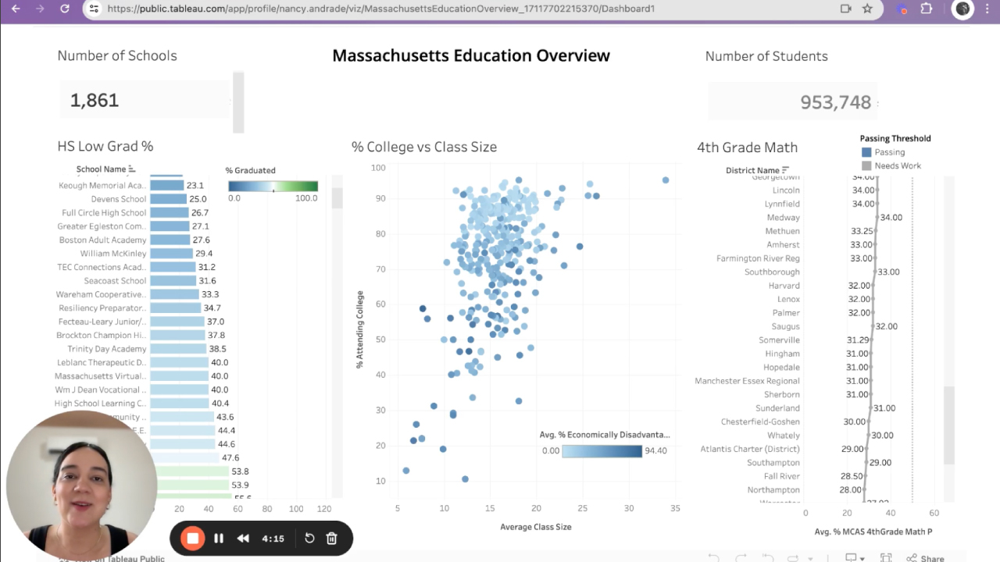

# Welcome to My Portfolio

---

### Learn About My Projects

#### [Internal Blog Post Project](/bank)

I'm a data analytics enthusiast and I'm eager to learn, find insights and create compelling dashboards that will help improve decision making.

---
#### [A Year in Sales - The DashDoor Project](https://www.linkedin.com/pulse/doordash-project-analyzing-sales-year-nancy-andrade-aguilar-ho9pc/)

I was intrigued to delve into the world of data analytics and explore one of the most popular platforms: **DoorDash.**

---
#### [Education Project](https://www.loom.com/share/5843062b022748e087d1c8ade7442c40?sid=7c995a7f-f05b-4fe6-85fe-c08164a0ffc9)

In this case study from Data Analytics Accelerator, I was prompted to analyze the State of Massachusetts education data. The main focuses were:
What schools are struggling the most?
How does class size affect college admission?
Which school districts are passing fourth grade math? 

---

### Category Name 2

- [Project 1 Title](http://example.com/)
- [Project 2 Title](http://example.com/)
- [Project 3 Title](http://example.com/)
- [Project 4 Title](http://example.com/)
- [Project 5 Title](http://example.com/)

---

